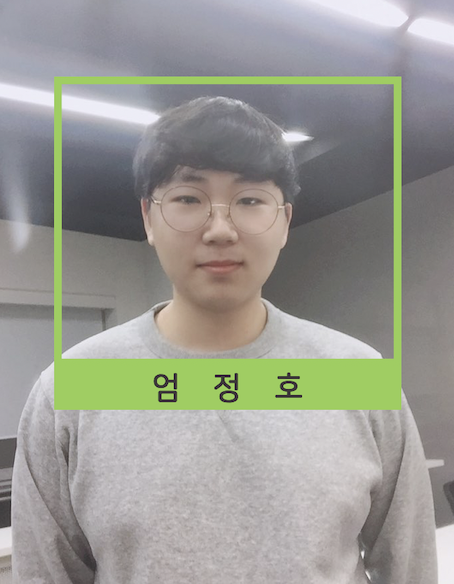

### 팀페이지 주소 -> https://kookmin-sw.github.io/2019-cap1-2019_19

## 1. 프로젝트 소개

 본 프로젝트는 cctv의 기능을 포함하여 복잡한 전선 연결 없이 설치가 간편하도록 인터폰을 제작한다. 또한, 오픈소스를 이용하여 부가적인 기능을 제외하고 얼굴인식 및 알림 등의 필수 기능만을 최소한으로 구현하여 가격대를 낮추고, 스마트폰뿐만 아니라 웹페이지를 통해서도 서비스를 제공하여 사용자에게 편리하고 효율적인 스마트 인터폰을 만드는 것을 목표로 한다.
 
## 2. abstract
Our **‘JEONGHO-FIVE’** team aims to implement a system named **‘BANGBANG’**, which overcomes the limitations of usual interphone that users can only use inside.

‘BANGBANG’ includes the function of **CCTV** and is designed to be easy to install **without complex wire connections.** Using **OPENFACE API** that detect faces and determine who he is(or who they are), only essential functions such as **FACE RECOGNITION**, and **NOTIFICATION** are implemented to a minimum.

‘BANGBANG’ is connected to the **APP** using the IP address of the raspberry pie. So users can talk to outsiders in front of the house without time or space constraint. Also, it can be streamed anywhere. **Users can monitor the situation in front of their home anywhere and ultimately prevent crimes!**

If the user couldn’t immediately check the notification that an outsider has visited, the user can inquire the notification and the history of previous visits to outsiders through the visit records of the app. Visit records show the date and the time of the visit, the visitor(name of an outsider or recognized acquaintance), and provide a video clip that stores the situation of the time.

If these functions are provided only through mobiles, it is difficult for elderly, young children, or those who don’t have a smartphone or don’t know how to use smartphone well. To overcome this, **we also offer services on WEBPAGE and INDOOR MONITOR that are light and mobile.**

**ANYTIME, ANYWHERE, YOU CAN PROTECT YOUR HOUSE WITH BANGBANG!**


## 3. 소개 영상
https://youtu.be/u1_oJqWSfaQ


## 4. 팀 소개


### 이수진(팀장)
```
e-mail: dltnwls8751@gmail.com
역할: AI & APP
```


### 엄정호
```
e-mail: eomjeongho1@naver.com
역할: BOARD & WEB
```


### 경혜안
```
e-mail: hean1103@naver.com 
역할: AI & APP
```


### 최은주
```
e-mail: eunju1215@kookmin.ac.kr 
역할: AI & APP
```

### 황승애
```
e-mail: ghkdtmddo01@naver.com
역할: BOARD & WEB
```

